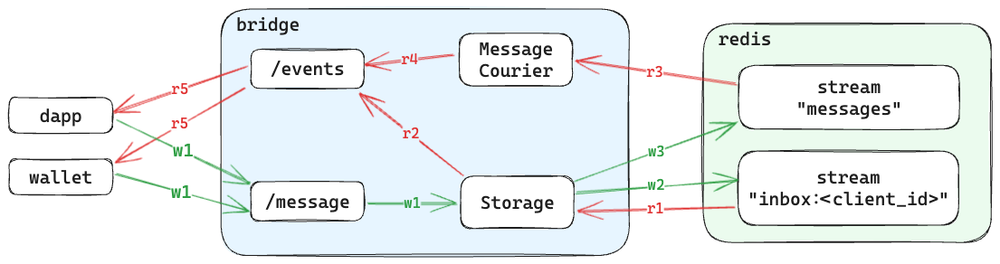

# Architecture

## Write Flow

Whenever Dapp/Wallet sends a message to another client via the `/message` endpoint, the bridge performs a simple task: it stores the message in the Redis Stream dedicated to the client that the message is addressed to, and then stores the same message in the global Stream. Why are two streams used? The global "messages" stream is used to deliver all messages in a somewhat real-time manner. All MessageCouriers from all app instances are subscribed to that stream and read all messages from there, then route them to the corresponding client if it is connected to their instance. This stream could be easily replaced with Pub/Sub, but streams can handle short network/Redis outages better and do not lose unprocessed messages. The other stream - "inbox" is a per-client stream that keeps messages for a configured period of time and is used only when a client not only subscribes for new messages but also requests previous messages via the `last_event_id` query parameter in the `/events` endpoint.

## Read Flow

Dapp/Wallet subscribes for messages via the `/events` endpoint. If they specify the `last_event_id` parameter, then the bridge checks for old messages from the corresponding "inbox" streams first (via the Storage abstraction), and only then subscribes for new messages via the MessageCourier. Both old and new messages are returned through the same SSE endpoint, with old messages being returned first.

## Redis Streams

To minimize resource consumption by Redis, it is possible to configure:

- max size (in terms of number of messages) for both "messages" and "inbox" streams
- ttl for "inbox" streams for each client, i.e., if there are no new messages in a certain "inbox" stream, it will be disposed
- for how long the "inbox" streams should store messages
